# EventPulse - A Local Event Finder

## Description

### Purpose

CommunityConnect contacted us to create EventPulse, a local event finder app, so people are able to find various events happening around them. Additionally, EventPulse allows event organisers to advertise their events and find their target demographic. Ultimately, this app allows for people to connect with others and helps build a sense of community within an area.

### Functionality/features

#### Login/sign-up

- Email
- Password
- Location
- Preferences
  - Music Events
  - Sports Events
  - Markets/Food Events
  - Community Events

#### Home Page

- Local events in area shown in blog format
  - Image
  - Event name
  - Location
  - Date
  - Short Description
- Search for events
  - Event name
  - Location
  - Category/preference

#### Event Page

- Image
- Event name
- Location
- Date
- Host
- Description
- Share (email/social media)
- RSVP
- Number of RSVP's

#### Account

- View/change account information
  - Location
  - Preferences
- RSVP'd events
  - Email notifications about upcoming events
- Event Creation
  - Image
  - Event Name
  - Description
  - Location
  - Date/time

### Target Audience

There would be a wide target audience for this app as it caters to a wide range of events, so the audience would include people looking to go to events in their area and people looking to advertise an event. Additionally, the app could serve as a platform to keep someone's events organised, as they could see which events they have coming up and get notifications closer to the date. People that would like to share events they're interested in with their network would also be a target audience.  
  
### Tech Stack

#### Front End

- HTML
- CSS
  - MaterialUI
- Javascript (ReactJS)

#### Backend

- ExpressJS
  - Mongoose
- NodeJS
- MongoDB

## Dataflow Diagram

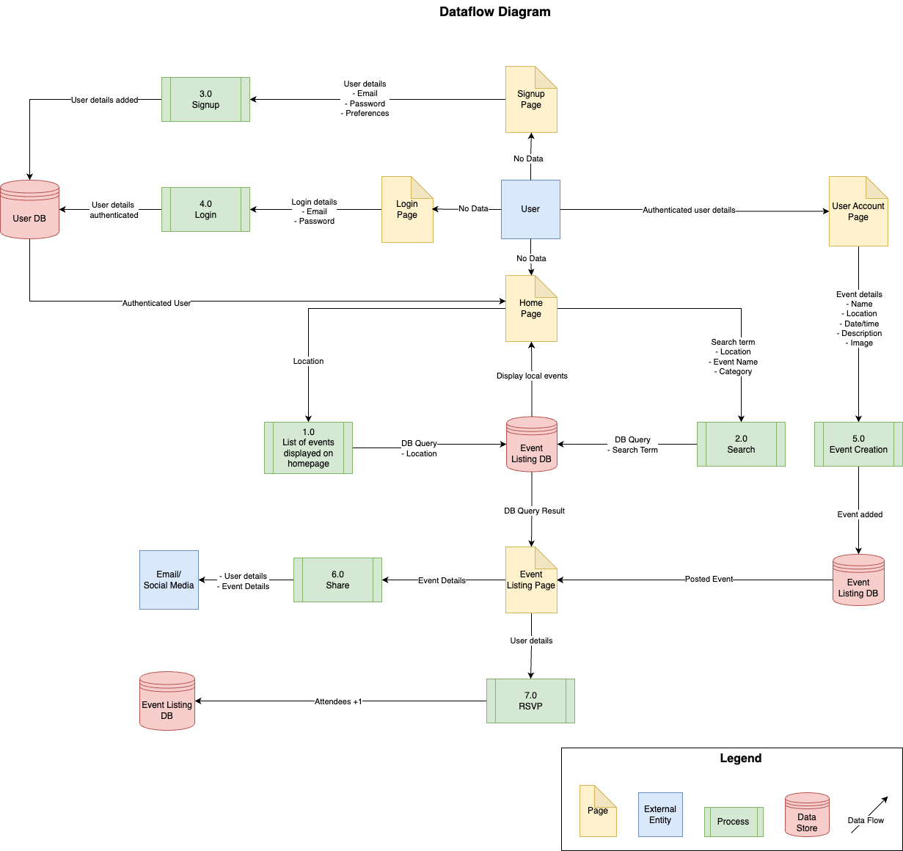\  

## Application Architecture Diagram

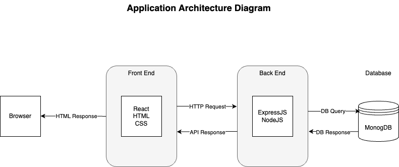\  

## User Stories

### Original User Stories  
  
|Name|Persona|Use case|  
|----|-------|--------|  
|Jack|Jack likes to do things with his friends on the weekend and is looking for something to do this weekend|Use EventPulse to find events|
|Abbey|Abbey is an event manager, organising music events but also other types of events|Use EventPulse to advertise her events|
|Luca|Luca has lots of events coming up and always forgets when they are going to happen|Use EventPulse to get reminders for upcoming events|  
|Sam|Sam wants to let her friends know about an event that they're going to|Use EventPulse to share an event with friends|
|Hayden|Hayden has an event he's planned and wants to know how many people are coming|Use EventPulse to see number of attendees|
  
- As Jack, I want to be able to see the events that are happening around me, so I can make plans in my free time  
- As Abbey, I want to be able to post my event and share it with the community, so I can get an audience at my events  
- As Luca, I want to be able to plan and get reminders for events that are upcoming, so I don't forget what events I have coming up
- As Sam, I want to be able to share events I'm interested in by email or social media, so I can go to events with my friends
- As Hayden, I want people to be able to RSVP to my event, so I can see the number of attendees for my event

### Revised User Stories  
  
|Name|Persona|Use case|  
|----|-------|--------|  
|Jack|Jack likes to do things with his friends on the weekend and is looking for something to do this weekend|Use EventPulse to find events|
|Abbey|Abbey is an event manager, organising music events but also other types of events|Use EventPulse to advertise her events|
|Luca|Luca has lots of events coming up and always forgets when they are going to happen|Use EventPulse to get reminders for upcoming events|  
|Sam|Sam wants to let her friends know about an event that they're going to|Use EventPulse to share an event with friends|
|Hayden|Hayden has an event he's planned and wants to know how many people are coming|Use EventPulse to see number of attendees|

- As Jack, I want to be able to see the events that are happening around me by searching for the type of events I like, so I can make plans in my free time  
- As Jack, I want to be able to view the events that are happening around me on the home page of EventPulse, so I can make plans in my free time
- As Abbey, I want to be able to post my event and share it with the community, so I can get an audience at my events  
- As Luca, I want to be able to plan and get reminders for events that are upcoming, so I don't forget what events I have coming up
- As Sam, I want to be able to share events I'm interested in by email or social media, so I can go to events with my friends
- As Hayden, I want people to be able to RSVP to my event and see the number of attendees, so I can plan my event better

## Wireframes  
  
### Home Page Wireframe  
  
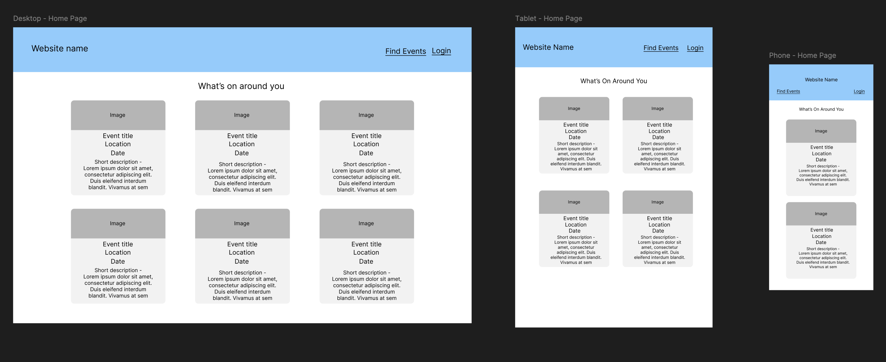\  
  
### Event Page Wireframe  
  
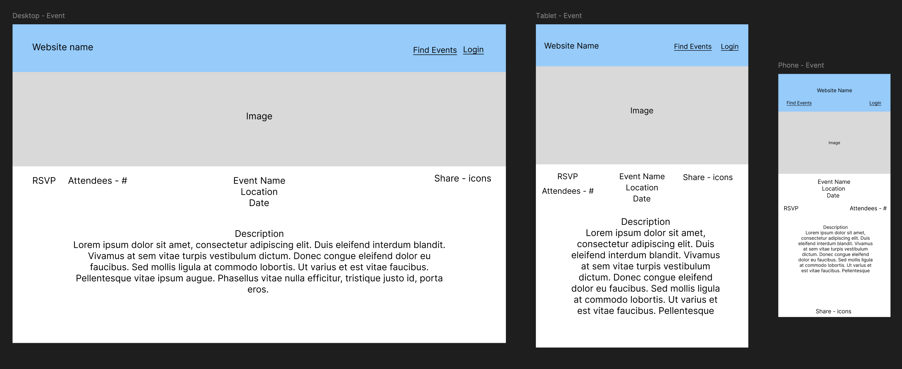\  
  
### Login Page Wireframe  
  
\  
  
### Sign-up Page Wireframe  
  
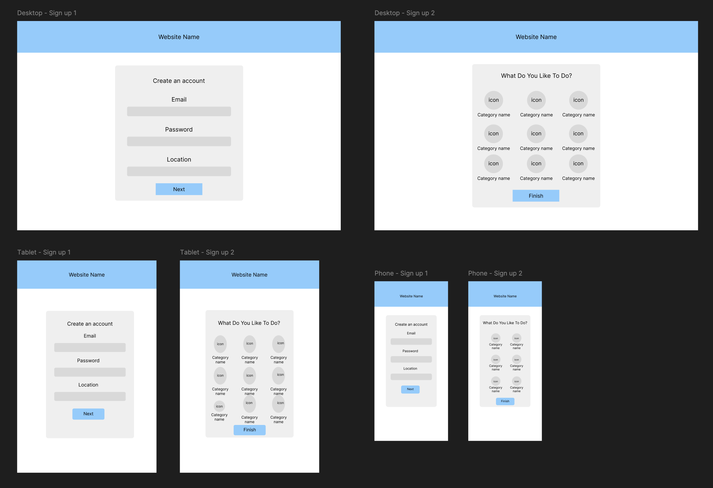\  
  
### Account Page Wireframe  
  
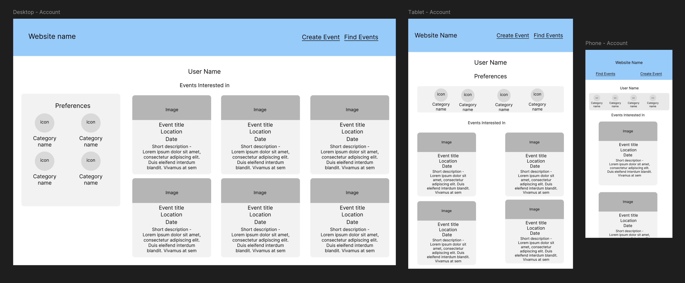\  
  
### Event Creation Page Wireframe  
  
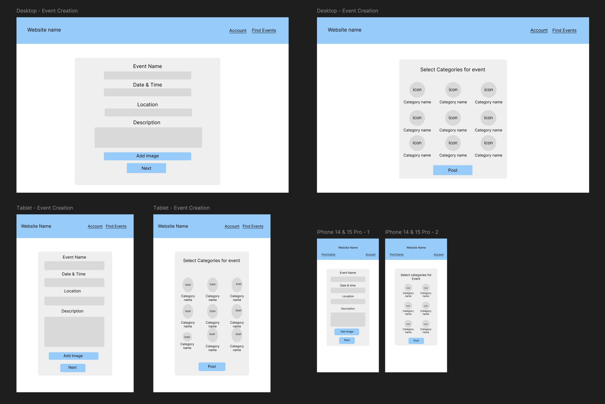\  
  
## Trello Board

### Trello Board Overview  

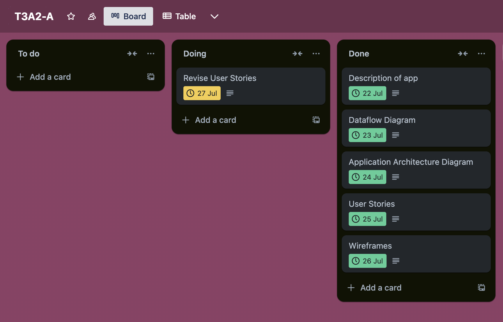\  

### Trello Cards  

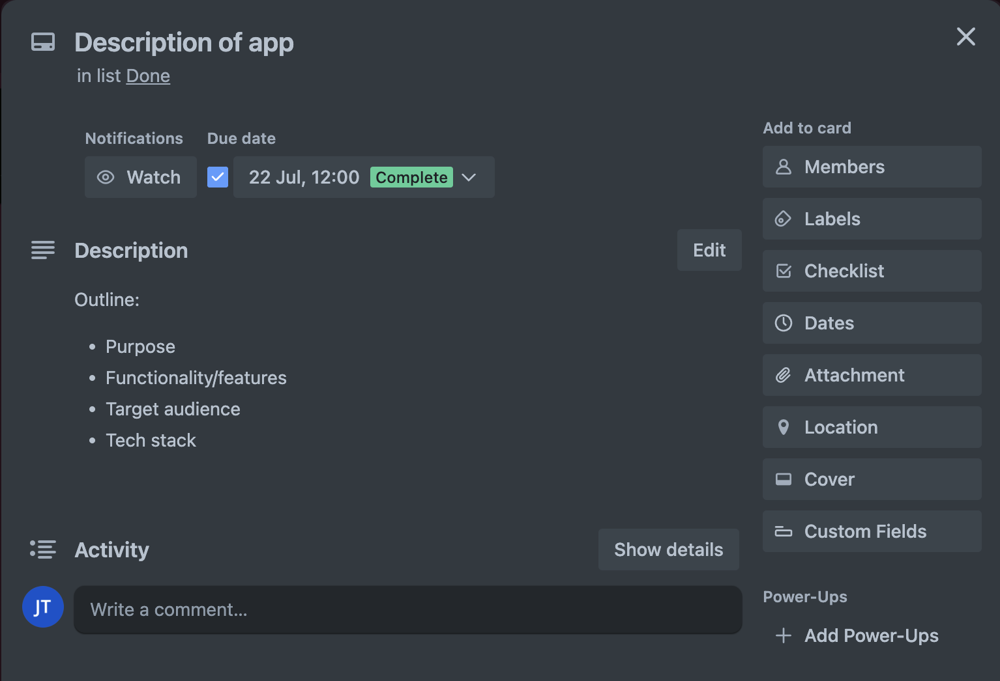\  
  
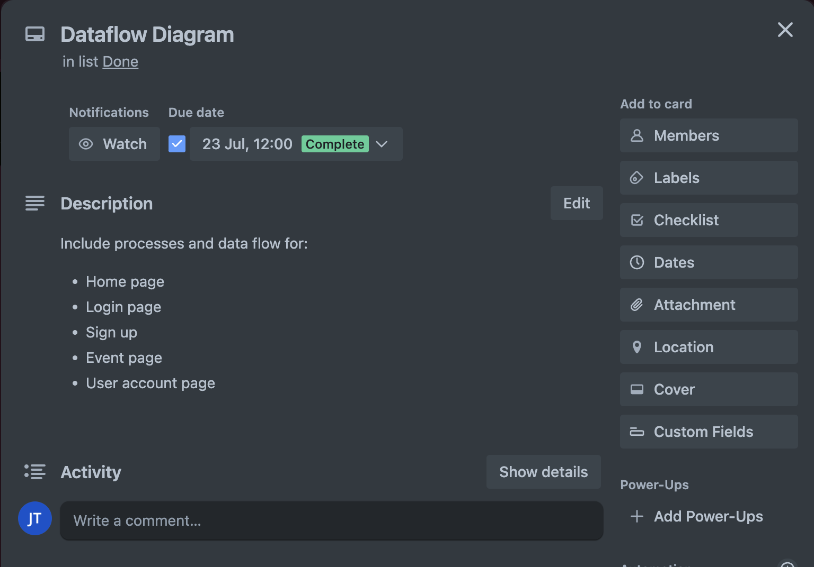\  
  
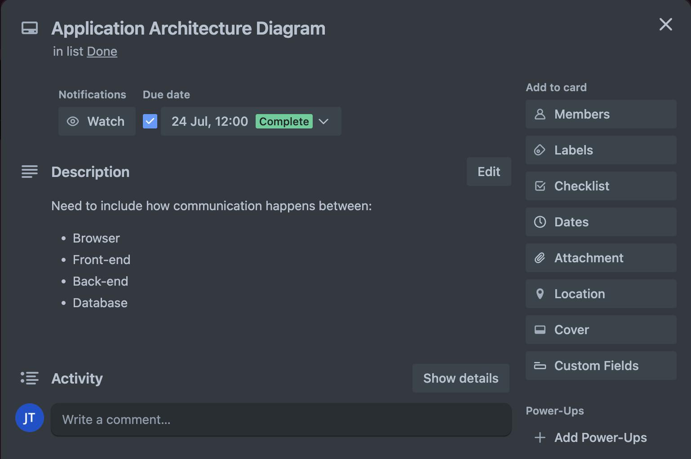\  
  
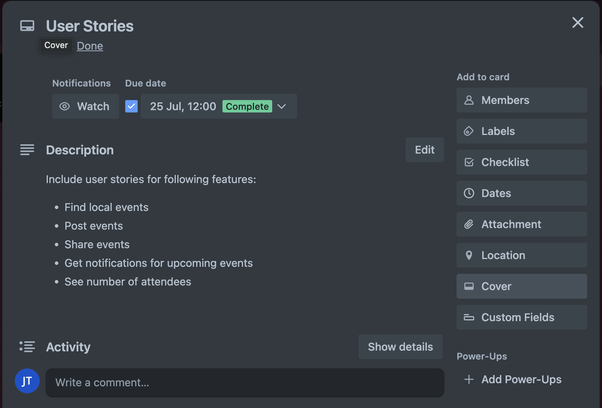\  
  
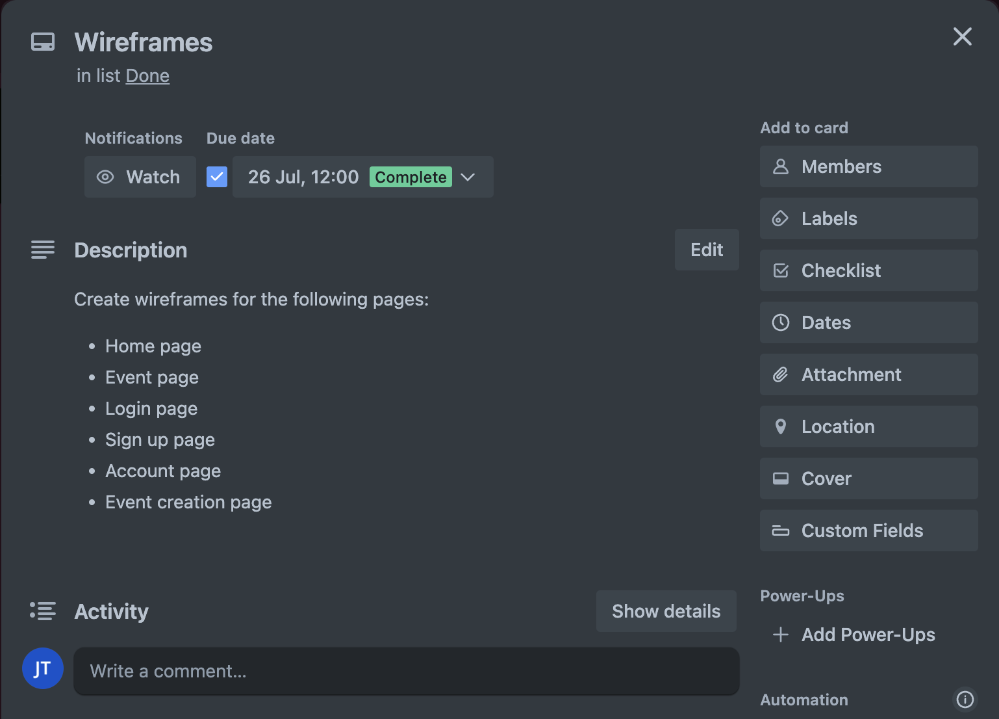\  
  
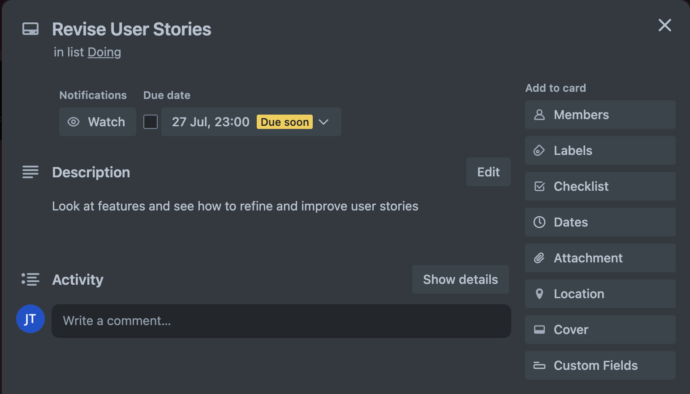\
